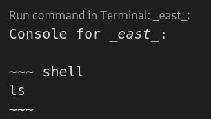

# markdoc-command-runner

`markdoc-command-runner` is a lightweight VS Code extension to run commands in READMEs in one-click.
It adds a CodeLens action to run shell snippets in any markdown file.

NOTE:This fork of https://github.com/Ackar/markdown-command-runner

It allows you to quickly test readme files generated from 
https://github.com/skupperproject/skewer

## Installation

Manually install the https://github.com/pwright/markdown-command-runner/raw/master/markdoc-command-runner-0.0.1.vsix extension in VSCode.

## How does it work?

`markdown-command-runner` detects patterns from skewer generated readme markdown files and adds
a `Run command in terminal` action at the top.

When clicked the associated snippet is run the current active terminal or a new one if it is busy.

## Example:

Console for _east_:

~~~ shell
ls -al
~~~

In VSCode this appears as:

